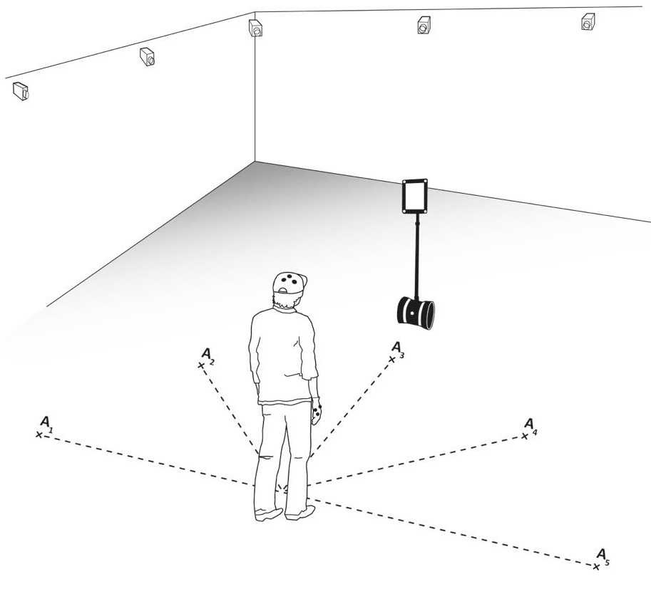
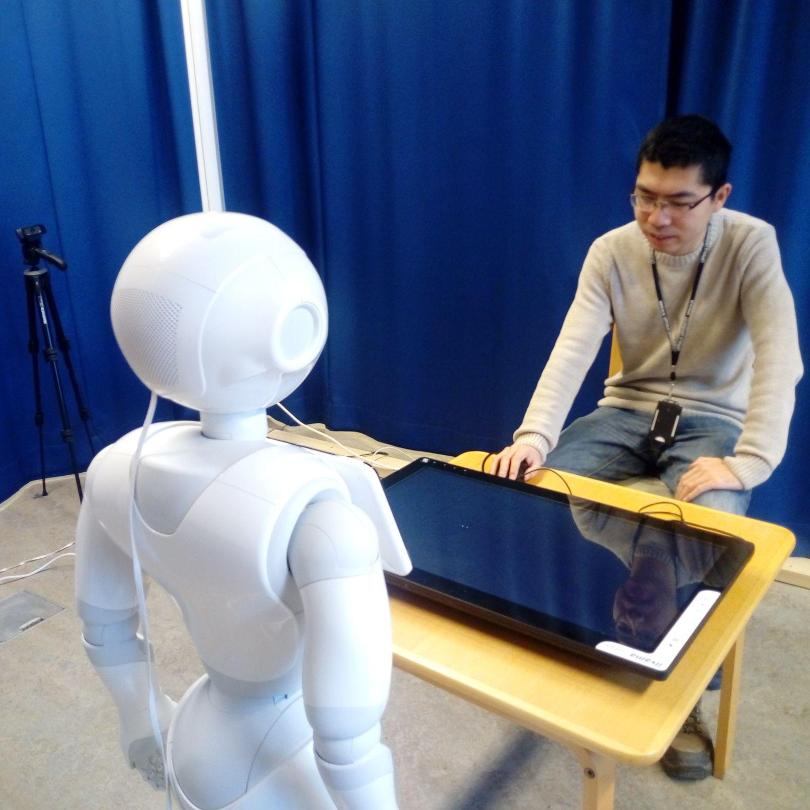

    

		
    
  
    

    <h4>Investigating Deep Learning Approaches for Human-Robot Proxemics [<a href="papers/investigate-deep-learning-proximics.pdf">Download</a>]</h4>
    
 Yuan Gao, Sebastian Wallkötter, Mohammad Obaid, Ginevra Castellano,

    
RO-MAN, 2018

    

    

		
    
  
    

    <h4>When robot personalisation does not help: Insights from a robot-supported learning study [<a href="papers/when-robot-does-not-help.pdf">Download</a>]</h4>
    
 Yuan Gao, Wolmet Barendregt, Mohammad Obaid, Ginevra Castellano,

    
RO-MAN, 2018

    

