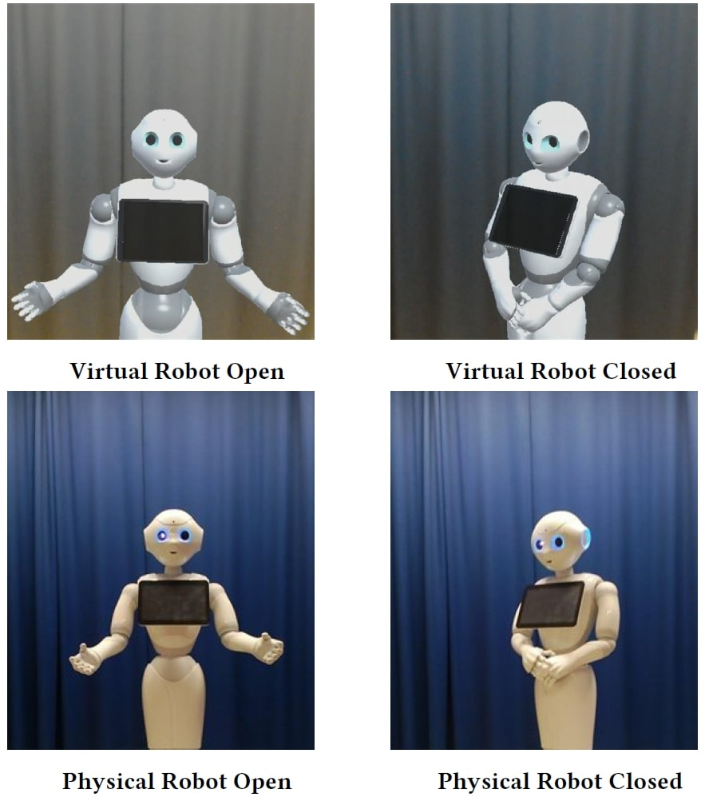

    

		
    
  
    

    <h4>Social Behavior Learning with Realistic Reward Shaping</h4>
    
 Yuan Gao, Fangkai Yang, Martin Frisk, Daniel Hernandez, Christopher Peters and Ginevra Castellano

	<h6></h6>
	<button class="button black" onclick="window.open('https://github.com/usr-lab/PepperSocial')" type="button">GitHub</button><button id="abstract_btn" class="button black" onclick="toggleAbstract(this);" type="button">Abstract</button><button class="button black" onclick="window.open('https://arxiv.org/pdf/1810.06979')" type="button">Download</button>
	

	
arXiv, 2018

    

    

		
    
  
    

    <h4>Effects of Posture and Embodiment on Social Distance in Human-Agent Interaction in Mixed Reality</h4>
    
 Chengjie Li, Theofronia Androulakaki, Yuan Gao, Fangkai Yang, Himangshu Saikia, Christopher Peters and Gabriel Skantze

	<h6></h6>
	<button id="abstract_btn" class="button black" onclick="toggleAbstract(this);" type="button">Abstract</button>
	<button class="button black" onclick="alert('Sorry, the paper is not publically available yet.')" type="button"></button>
	

	
Intelligent Virtual Agents, October 2018

    

    

		
    
  
    

    <h4>Human-Robot Proxemics using Recurrent Neural Networks</h4>
    
 Yuan Gao, Sebastian Wallkötter, Mohammad Obaid and Ginevra Castellano

	<h6></h6>
	<button id="abstract_btn" class="button black" onclick="toggleAbstract(this);" type="button">Abstract</button><button class="button black" onclick="window.open('papers/investigate-deep-learning-proximics.pdf')" type="button">Download</button>
	

    
RO-MAN, 2018

    

    

		
    
  
    

    <h4>When robot personalisation does not help: Insights from a robot-supported learning study </h4>
    
 Yuan Gao, Wolmet Barendregt, Mohammad Obaid and Ginevra Castellano,

    <h6></h6>
	<button id="abstract_btn" class="button black" onclick="toggleAbstract(this);" type="button">Abstract</button><button class="button black" onclick="window.open('papers/when-robot-does-not-help.pdf')" type="button">Download</button>
	

    
RO-MAN, 2018

    

 
